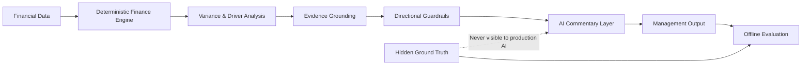

# CFO Intelligence Copilot

**Live demo:** https://cfo-intelligence-copilot.streamlit.app

An evidence-grounded financial analysis system that combines deterministic finance calculations with controlled AI-generated management commentary.

The project is built around a simple principle:

> AI should explain financial performance only when the available evidence actually supports the explanation.

Rather than giving a language model raw financial data and asking it to "analyze the business", the system separates financial calculation, evidence retrieval, validation and AI interpretation into distinct layers.

---

## Overview

CFO Intelligence Copilot analyzes financial performance for a synthetic company, **Northstar Systems AS**.

The system compares financial performance against budget and produces:

- Revenue variance analysis
- Gross profit variance analysis
- OPEX variance analysis
- EBITDA and margin analysis
- Country-level performance drivers
- Product-level performance drivers
- Cost-centre and account-level OPEX drivers
- Evidence-supported management explanations
- Explicit unresolved findings when evidence is insufficient
- Management questions for further investigation

The AI model is **not responsible for calculating the financial results**.

All core financial calculations are produced deterministically in Python before information reaches the AI layer.

---

## Interactive Application

The project includes a public Streamlit application with four main sections:

### Executive Overview

Provides a management-level view of:

- Revenue
- Gross profit
- OPEX
- EBITDA
- EBITDA margin
- AI-generated executive commentary
- Evidence-supported drivers
- Unresolved findings
- Management questions

### Evidence & Guardrails

Shows how evidence is evaluated before it can be used by the AI.

Evidence must pass:

- Entity compatibility
- Driver compatibility
- Directional consistency checks

Relevant evidence can therefore be withheld when it does not validly explain the observed financial variance.

### Evaluation & Safety

A separate offline evaluation layer tests the pipeline against controlled hidden ground-truth events.

The production AI never receives this hidden information.

The evaluation verifies areas including:

- Evidence routing
- Citation validity
- Evidence utilization
- Directional guardrails
- Ground-truth isolation
- Invalid evidence detection

The project currently includes a **51-test regression suite**.

### Data Explorer

The underlying processed sales data used by the finance analysis can be inspected directly inside the application.

Users can switch between:

- Actual
- Budget
- Latest Forecast

The data can be filtered by:

- Date
- Country
- Product family
- Product
- Customer segment

The explorer provides:

- Units
- Net revenue
- Gross profit
- Gross margin
- Business-dimension breakdowns
- Filtered row-level sales records
- CSV export of the complete filtered dataset

Only analyst-visible processed data is loaded by the Data Explorer.

Hidden ground-truth files are never exposed through this interface.

---

## Why This Project Exists

Large language models are good at explaining information, but financial analysis requires more than fluent text.

A useful finance AI system should be able to distinguish between:

1. **Calculated financial facts**
2. **Available supporting evidence**
3. **AI-generated interpretation**
4. **Unsupported hypotheses**

CFO Intelligence Copilot was designed around this separation.

If the system cannot support an explanation with approved evidence, it explicitly leaves the finding unresolved instead of allowing the AI to invent a plausible cause.

---

## Architecture



The architecture deliberately separates deterministic calculation from probabilistic language-model interpretation.

---

## Financial Data

The project uses a synthetic financial environment built for **Northstar Systems AS**.

Sales data includes dimensions such as:

- Date
- Country
- Product
- Product family
- Customer segment
- Units
- List price
- Discount rate
- Gross sales
- Net revenue
- Unit cost
- COGS
- Gross profit
- Gross margin

Separate datasets are maintained for:

- Actual performance
- Budget
- Latest Forecast

OPEX data is also modeled across cost centres and expense accounts.

---

## Evidence Grounding

Management explanations are not generated directly from financial variances.

The system first attempts to connect calculated findings to approved analyst-visible evidence.

Evidence is checked for compatibility with the:

- Financial entity
- Identified variance driver
- Direction of the financial impact

Only evidence that passes these controls becomes available to the AI commentary layer.

When sufficient evidence does not exist, the system returns an unresolved finding rather than generating an unsupported explanation.

---

## Hidden-Ground-Truth Evaluation

Controlled synthetic business events are stored separately from the information available to the AI.

These hidden events are used only after generation to evaluate how the pipeline behaved.

This makes it possible to test whether:

- Valid evidence reached the AI
- Unsupported evidence was rejected
- Directionally conflicting evidence was withheld
- Events without analyst-visible evidence remained unresolved
- Hidden ground truth remained isolated from the model

The offline evaluator does not make an API request and does not expose hidden event information to the production AI.

---

## Technology

The project is built primarily with:

- Python
- Pandas
- OpenAI API
- Pydantic
- Streamlit
- Pytest
- Git
- GitHub

---

## Repository Structure

```text
CFO-Intelligence-Copilot/
│
├── data/
│   ├── processed/
│   ├── documents/
│   └── ground_truth/
│
├── outputs/
│   ├── analysis/
│   ├── evidence/
│   ├── grounding/
│   ├── ai/
│   └── evaluation/
│
├── src/
│   ├── ai/
│   ├── analysis/
│   ├── data_generation/
│   ├── evaluation/
│   ├── evidence/
│   ├── finance_engine/
│   ├── retrieval/
│   └── validation/
│
├── tests/
├── streamlit_app.py
├── requirements.txt
└── README.md
```

---

## Run Locally

Clone the repository:

```bash
git clone https://github.com/AndreasOftedal/CFO-Intelligence-Copilot.git
cd CFO-Intelligence-Copilot
```

Create and activate a virtual environment, then install the dependencies:

```bash
pip install -r requirements.txt
```

Run the application:

```bash
streamlit run streamlit_app.py
```

The application will normally open at:

```text
http://localhost:8501
```

---

## Project Scope

This is a **synthetic portfolio project** built to demonstrate the combination of:

- Financial analysis
- FP&A logic
- Data engineering
- Generative AI
- Evidence grounding
- Model guardrails
- Automated testing
- AI evaluation
- Interactive data exploration

It is not based on confidential company data.