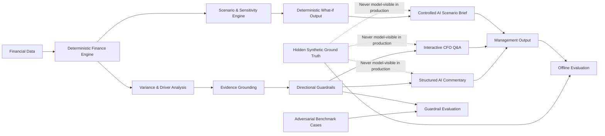

# CFO Intelligence Copilot

[](https://github.com/AndreasOftedal/CFO-Intelligence-Copilot/actions/workflows/ci.yml)

**Live demo:** https://cfo-intelligence-copilot.streamlit.app

CFO Intelligence Copilot is a synthetic FP&A and applied-AI portfolio project that combines deterministic financial analysis, evidence controls, interactive AI Q&A, scenario modelling and offline evaluation.

The core design principle is simple:

> AI should explain financial performance only when the available evidence actually supports the explanation.

The system therefore separates calculation, evidence validation and language-model interpretation instead of asking an LLM to calculate or freely explain financial results.

---

## What the Project Demonstrates

The project is built around **Northstar Systems AS**, a fully synthetic company with Actual, Budget and Latest Forecast data.

It demonstrates how a finance workflow can combine:

- Deterministic revenue, gross profit, OPEX and EBITDA calculations
- Variance and driver decomposition
- Country, product, cost-centre and account analysis
- Dynamic analysis periods
- Evidence grounding and directional guardrails
- Structured AI-generated management commentary
- Interactive evidence-grounded CFO Q&A
- Scenario and sensitivity modelling
- Controlled AI interpretation of deterministic scenario outputs
- Hidden-ground-truth offline evaluation
- Adversarial evidence-control testing
- Guarded-vs-prompt-only LLM benchmarking
- Streamlit deployment
- Automated regression testing in GitHub Actions

The AI model is **not responsible for calculating financial results**. Core finance outputs are calculated first in Python and only then exposed to the AI layer.

---

## Live Application

The public Streamlit app currently contains six main sections.

### 1. Executive Overview

Management-level summary of the selected analysis period, including:

- Revenue
- Gross Profit
- OPEX
- EBITDA
- EBITDA Margin
- AI-generated executive commentary
- Evidence-supported explanations
- Unresolved findings
- Management questions

The analysis period can be switched between:

- **Latest Forecast vs Budget**
- **Actual YTD vs Budget**

---

### 2. Ask the CFO

Interactive management Q&A built on top of the existing calculated findings and approved evidence.

The assistant can:

- Answer questions using deterministic financial findings
- Use only evidence already approved by the control layer
- Cite the finding IDs and evidence IDs used
- Surface limitations when evidence is insufficient
- Keep unsupported causes unresolved

The interactive assistant cannot access hidden ground truth.

A live-session question limit is used in the public demo to control API usage.

---

### 3. Scenario & Sensitivity Lab

A controlled what-if environment using **Latest Forecast** as the baseline.

Management assumptions can be changed for:

- Volume
- List price
- Discount, expressed as an absolute percentage-point change
- Unit cost
- Headcount
- Non-payroll OPEX

The scenario engine deterministically recalculates:

- Revenue
- Gross Profit
- OPEX
- EBITDA
- EBITDA Margin

It also produces:

- Reconciled EBITDA driver bridge
- Materiality flags
- One-way sensitivity tables
- Selectable sensitivity curves for Revenue, Gross Profit, OPEX, EBITDA and margin

All scenario calculations reuse the same deterministic finance logic as the core analysis engine.

An optional **AI Scenario Brief** can then interpret the calculated scenario. The AI receives only deterministic scenario assumptions, calculated financial outcomes and the reconciled EBITDA bridge. It cannot access management evidence or hidden ground truth, cannot calculate new financial values, and is validated before its narrative is displayed.

The Scenario Brief is reset automatically when scenario assumptions change so commentary generated for an earlier scenario cannot remain visible against a new set of inputs.

---

### 4. Evidence & Guardrails

Calculated findings are not automatically allowed to use management evidence.

Evidence must pass:

1. **Entity compatibility**
2. **Driver compatibility**
3. **Directional consistency**

This prevents evidence that merely sounds relevant from being used as a causal explanation when it does not support the calculated financial finding.

When approved evidence does not exist, the system explicitly returns an unresolved finding instead of inventing a cause.

---

### 5. Evaluation & Safety

The project includes several offline evaluation layers.

#### Cross-Period Evaluation

Tests evidence routing and control behaviour for both:

- Latest Forecast vs Budget
- Actual YTD vs Budget

#### Adversarial Safety Benchmark

A controlled synthetic benchmark covers cases such as:

- Valid supported evidence
- No evidence
- Wrong entity
- Wrong driver
- Directional conflict
- Ambiguous evidence
- Multi-event situations

Current deterministic benchmark result:

- **32 / 32 cases passed**
- **100% routing accuracy**
- **100% correct abstention**
- **0% unsupported explanation rate**

#### Guarded vs Prompt-Only LLM Benchmark

The same model, structured-output schema and financial findings are evaluated under two evidence conditions:

- **Guarded:** only evidence approved by deterministic controls
- **Prompt-only baseline:** all candidate evidence is provided and the model must reject unsupported explanations through instructions alone

In one controlled 32-case synthetic benchmark run:

- Unsupported explanation rate: **14.8% → 0.0%**
- Citation precision: **73.3% → 100.0%**
- Supported explanation recall: **100.0% in both conditions**

These benchmark results describe this controlled synthetic evaluation only; they are not intended as universal claims about model performance.

---

### 6. Data Explorer

Interactive inspection of analyst-visible processed sales data.

Available datasets:

- Actual
- Budget
- Latest Forecast

Filters include:

- Date
- Country
- Product family
- Product
- Customer segment

The explorer provides:

- Units
- Net revenue
- Gross profit
- Gross margin
- Business-dimension breakdowns
- Filtered row-level records
- CSV export

Hidden ground-truth data is not exposed through the Data Explorer.

---

## Architecture



The architecture deliberately separates deterministic calculation from probabilistic language-model interpretation.

---

## Deterministic Finance Engine

The finance layer performs the core calculations before any information reaches the AI.

Commercial analysis includes:

- Volume & mix
- List price
- Discount
- Unit cost

OPEX analysis includes:

- Headcount
- Employee cost
- Non-payroll OPEX

The engine reconciles:

- Revenue
- Gross Profit
- OPEX
- EBITDA
- EBITDA Margin

Scenario modelling reuses the same deterministic calculation logic instead of maintaining a separate finance calculator. The Scenario Brief sits downstream of those calculations and is restricted to interpreting already-calculated outputs.

---

## Evidence Grounding

Management explanations are generated only after calculated findings have been matched to compatible analyst-visible evidence.

Evidence is evaluated against:

- Entity
- Driver
- Scope
- Financial direction

Possible outcomes include:

- Supported
- Partial support
- Related but not explanatory
- Insufficient evidence
- Directionally conflicting / withheld

Only approved evidence is model-visible for causal explanations.

The **AI Scenario Brief** is intentionally separate from this evidence flow. It interprets user-selected what-if assumptions and deterministic scenario results only; management evidence is not exposed to that feature.

---

## Hidden-Ground-Truth Evaluation

Controlled synthetic events are stored separately from production model inputs.

They are used after the production pipeline has run to evaluate whether:

- Valid evidence reached the AI
- Unsupported evidence was rejected
- Wrong-driver evidence was blocked
- Wrong-entity evidence was blocked
- Directionally conflicting evidence was withheld
- No-evidence cases remained unresolved
- Hidden ground truth remained isolated from the model

"Hidden" in this project means **hidden from the production AI pipeline**. The repository itself is public and the synthetic evaluation files are intentionally available for inspection.

---

## Repository Structure

```text
CFO-Intelligence-Copilot/
│
├── .github/
│   └── workflows/
│       └── ci.yml
│
├── data/
│   ├── processed/
│   ├── documents/
│   ├── evaluation/
│   └── ground_truth/
│
├── outputs/
│   ├── analysis/
│   ├── ai/
│   ├── evaluation/
│   └── grounding/
│
├── src/
│   ├── ai/
│   ├── analysis/
│   ├── data_generation/
│   ├── evaluation/
│   ├── evidence/
│   └── scenario/
│
├── tests/
├── streamlit_app.py
├── requirements.txt
├── .env.example
└── README.md
```

---

## Technology

Primary technologies:

- Python 3.13
- Pandas
- OpenAI API
- Pydantic
- Streamlit
- Pytest
- Git
- GitHub Actions

---

## Run Locally

### 1. Clone the repository

```bash
git clone https://github.com/AndreasOftedal/CFO-Intelligence-Copilot.git
cd CFO-Intelligence-Copilot
```

### 2. Create a virtual environment

Windows PowerShell:

```powershell
python -m venv .venv
.venv\Scripts\Activate.ps1
```

macOS / Linux:

```bash
python3 -m venv .venv
source .venv/bin/activate
```

### 3. Install dependencies

```bash
python -m pip install --upgrade pip
python -m pip install -r requirements.txt
```

### 4. Optional: configure live AI features

The deterministic finance engine, scenario calculations, sensitivity analysis, evaluation outputs and most of the Streamlit application can be inspected without an API key.

To enable live **Ask the CFO** requests and the **AI Scenario Brief**, set:

```text
OPENAI_API_KEY=your_key_here
```

Both live AI features sit downstream of deterministic calculations and have separate controls that restrict what context the model can use.

For local development you can copy `.env.example` to `.env`, but do **not** commit API keys or local secret files.

The deployed Streamlit application uses Streamlit secrets for the API key.

### 5. Verify the installation

Compile the Streamlit application:

```bash
python -m py_compile streamlit_app.py
```

Run the full regression suite:

```bash
python -m pytest -q
```

Current expected result:

```text
135 passed
```

### 6. Launch Streamlit

```bash
streamlit run streamlit_app.py
```

The application will normally open at:

```text
http://localhost:8501
```

---

## Continuous Integration

GitHub Actions runs the project on **Python 3.13** for pull requests to `main` and pushes to `main`.

The CI workflow:

1. Checks out the repository
2. Sets up Python 3.13
3. Installs `requirements.txt`
4. Compiles `streamlit_app.py`
5. Runs the full Pytest regression suite

This provides an external reproducibility check independent of the local development environment.

---

## Secrets and Repository Hygiene

The repository intentionally ignores:

- `.venv/`
- `.env`
- `.env.*`
- `.streamlit/secrets.toml`
- Python caches
- Pytest and coverage artifacts
- IDE-local settings
- Build artifacts
- Logs

No API key is required in the repository.

---

## Reproducibility Notes

- Dependencies are pinned in `requirements.txt`.
- CI uses the same Python major/minor version used for development.
- Core finance calculations are deterministic.
- Scenario calculations reuse the production finance engine.
- AI Scenario Briefs are generated only from deterministic scenario assumptions, outcomes and reconciled driver data.
- Scenario Brief output is invalidated when scenario assumptions change.
- Evaluation benchmarks are reproducible from version-controlled synthetic data.
- Hidden ground truth is isolated from production model inputs.
- Live LLM outputs can vary across model/runtime updates, so deterministic and offline controls are tested separately from generation quality.

---

## Project Scope

This is a **synthetic portfolio project** built to demonstrate the combination of:

- Financial analysis
- FP&A logic
- Data engineering
- Applied generative AI
- Evidence grounding
- Model guardrails
- Scenario modelling
- AI evaluation
- Automated testing
- CI / reproducibility
- Interactive analytics

It is not based on confidential company data and should not be interpreted as production financial advice or a production risk-control framework.
